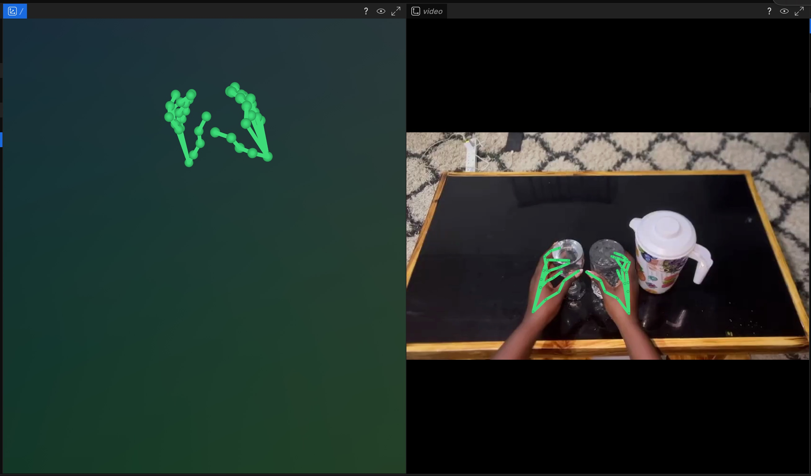

# Track Hands



This example reads videos from the HomER dataset, converts each video into a
robotics episode row, runs ego-vision hand tracking, and writes JSONL records
with raw hand-tracking annotations plus MANO and joint action conversions.

```python
from __future__ import annotations

from datetime import datetime, timezone
from typing import Any

from egovision.pipelines import to_joint_actions, to_mano_actions
import refiner as mdr

INPUT_DATASET = "toloka/HomER"
OUTPUT_ROOT = "hf://buckets/macrodata/test_bucket/homer-hand-tracking"
RUN_ID = datetime.now(timezone.utc).strftime("%Y%m%dT%H%M%SZ")
OUTPUT_DATASET = f"{OUTPUT_ROOT}/{RUN_ID}"


def hand_tracking_annotation(row: Any) -> dict[str, Any]:
    hand_tracking = row["hand_tracking"]
    return {
        "video_id": row["video_id"],
        "description": row["description"],
        "hand_tracking": hand_tracking,
        "mano_actions": to_mano_actions(hand_tracking),
        "joint_actions": to_joint_actions(hand_tracking),
    }


(
    mdr.read_hf_dataset(
        INPUT_DATASET,
        split="train",
        columns_to_read=("video_id", "video_url", "description"),
        dtypes={"video_url": mdr.datatype.video_path()},
    )
    .to_robot_rows(
        episode_id_key="video_id",
        task_key="description",
        fps=30.0,
        robot_type="human_hand_tracking",
        video_keys={"video": "video_url"},
    )
    .batch_map(
        mdr.robotics.track_hands(video_key="video", output_key="hand_tracking"),
        batch_size=2,
    )
    .map(hand_tracking_annotation)
    .write_jsonl(OUTPUT_DATASET)
    .launch_cloud(
        name="hand-tracking",
        num_workers=1,
        mem_mb_per_worker=32 * 1024,
        gpu=mdr.GPU(count=1, type="h100"),
        extra_dependencies=("ego-vision[models]==0.1.25",),
        secrets=mdr.Secrets.env(keys=("HF_TOKEN",)),
    )
)
```

Set `HF_TOKEN` in your local environment before launching so workers can read
the source dataset and write the output. The job requests one H100 because the
default ego-vision stack runs VGGT-Omega and HaWoR on CUDA.

For parameter details, output payload shape, and action conversion notes, see
[Hand Tracking](../../episode-operations/hand-tracking.md). The same workflow is
available as [`examples/hand_tracking.py`](../../../examples/hand_tracking.py).
